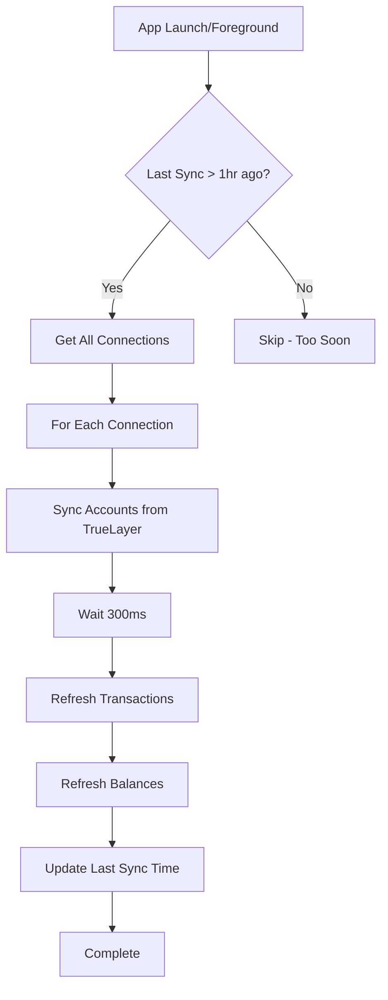

# Auto-Sync and Data Storage Architecture

## Overview

This document explains how automatic syncing works, what data is stored where, and the security architecture behind our TrueLayer integration. The system is designed to balance security, performance, and user experience, similar to industry-leading apps like Emma.

## Table of Contents

1. [Data Storage Architecture](#data-storage-architecture)
2. [Auto-Sync System](#auto-sync-system)
3. [Security Model](#security-model)
4. [Cross-Device Behavior](#cross-device-behavior)
5. [Cache Strategy](#cache-strategy)
6. [Implementation Details](#implementation-details)

---

## Data Storage Architecture

### What's Stored Where

#### 1. **Firestore (Cloud Database) - ✅ Synced Across Devices**

**Purpose:** Store non-sensitive metadata and user-created data

**Data Stored:**
- **Accounts** (metadata only):
  - `name` - Account display name
  - `type` - Account type (bank, card, cash, investment)
  - `currency` - Currency code (GBP, USD, etc.)
  - `truelayerConnectionId` - Connection identifier
  - `truelayerAccountId` - TrueLayer account identifier
  - `isSynced` - Whether account is synced from TrueLayer
  - `lastSyncedAt` - Last sync timestamp
  - `truelayerAccountType` - Account type from TrueLayer
  - `balance: 0` - Placeholder (actual balance NOT stored)

- **Manual Transactions** (user-created):
  - All transaction fields (amount, category, description, date)
  - Stored because user explicitly created them

- **Budgets, Subscriptions, Debts:**
  - All user-created financial planning data

- **Settings:**
  - User preferences and app configuration

**Why This Data is in Cloud:**
- Non-sensitive metadata needed for account identification
- User-created data that should be available on all devices
- Required for cross-device functionality

---

#### 2. **SecureStore/AsyncStorage (Local Device Cache) - ❌ Device-Specific**

**Purpose:** Encrypted local caching for sensitive financial data

**Data Stored:**

##### **TrueLayer Tokens** (SecureStore - Device Keychain)
```typescript
{
  id: "tl_1234567890_abc123",
  accessToken: "encrypted_access_token",
  refreshToken: "encrypted_refresh_token",
  expiresAt: 1234567890000,
  createdAt: "2024-01-01T00:00:00.000Z"
}
```
- **Location:** Device keychain/keystore (most secure)
- **Why Local:** Cannot be synced (security requirement)
- **Encryption:** Hardware-backed encryption (iOS Keychain, Android Keystore)

##### **Transaction Cache** (SecureStore/AsyncStorage)
```typescript
{
  transactions: Transaction[],
  metadata: {
    userId: "user123",
    connectionId: "tl_123...",
    accountId: "acc_456...",
    expiresAt: 1234567890000,
    cachedAt: 1234567890000,
    transactionCount: 150
  }
}
```
- **TTL:** 6 hours (transactions change less frequently)
- **Encryption:** SecureStore for small data, AsyncStorage for large (>2KB)
- **Why Local:** Security rule - "Do not persist raw financial data in cloud"

##### **Balance Cache** (SecureStore/AsyncStorage)
```typescript
{
  balance: 1234.56,
  currency: "GBP",
  metadata: {
    userId: "user123",
    connectionId: "tl_123...",
    accountId: "acc_456...",
    expiresAt: 1234567890000,
    cachedAt: 1234567890000
  }
}
```
- **TTL:** 30 minutes (balances change more frequently)
- **Encryption:** SecureStore for small data, AsyncStorage for large (>2KB)
- **Why Local:** Security rule - "Do not persist raw financial data in cloud"

**Why This Data is Local Only:**
- Follows `.cursorrules`: "Do not persist raw financial data unless strictly required"
- Maximum security (encrypted on-device only)
- GDPR compliant (minimal data retention with TTL)
- Tokens cannot be synced (device keychain requirement)

---

## Auto-Sync System

### How It Works

The auto-sync system automatically keeps your financial data up-to-date, similar to Emma's approach.

#### **Sync Triggers**

1. **App Launch**
   - Syncs 2 seconds after app opens
   - Ensures fresh data on startup

2. **App Foreground**
   - Syncs when app comes to foreground
   - Updates data after background period

3. **Manual Refresh**
   - Pull-to-refresh on any screen
   - Sync button on accounts

4. **Periodic Sync**
   - Minimum 1 hour between automatic syncs
   - Prevents excessive API calls

#### **Sync Process**



#### **What Gets Synced**

1. **Accounts**
   - Fetches latest account list from TrueLayer
   - Updates account metadata in Firestore
   - Does NOT store balances (fetched on-demand)

2. **Transactions**
   - Fetches latest transactions from TrueLayer API
   - Stores in encrypted local cache
   - Deduplicates using `truelayerTransactionId`

3. **Balances**
   - Fetches current balance from TrueLayer API
   - Stores in encrypted local cache
   - Used for display (not stored in Firestore)

#### **Sync Frequency**

| User Type | Sync Frequency | Implementation |
|-----------|---------------|----------------|
| Free | 1x per day | Minimum 1 hour between syncs |
| Premium | 4x per day | Configurable (currently 1 hour minimum) |

**Current Configuration:**
- Minimum interval: 1 hour
- Sync on foreground: ✅ Enabled
- Sync on launch: ✅ Enabled

---

## Security Model

### Principles

1. **Minimize Persisted Data**
   - Only store what's absolutely necessary
   - No raw financial data in cloud
   - Metadata only in Firestore

2. **Encryption at Rest**
   - SecureStore uses hardware-backed encryption
   - iOS: Keychain Services
   - Android: Keystore System

3. **Per-User Isolation**
   - All cache keys include `userId`
   - Prevents cross-user data access

4. **Auto-Expiring Cache**
   - TTL-based expiration (GDPR compliant)
   - Transactions: 6 hours
   - Balances: 30 minutes

5. **Token Security**
   - Tokens stored in device keychain
   - Auto-refresh when expired
   - Never logged or exposed

### Security Compliance

✅ **Follows `.cursorrules`:**
- "Do not persist raw financial data unless strictly required"
- "Minimise persisted state"
- "No unnecessary data retention"

✅ **GDPR Compliant:**
- Auto-expiring cache (TTL)
- Per-user isolation
- No cloud persistence of sensitive data

✅ **Industry Best Practices:**
- Similar to Emma, Mint, YNAB
- Bank-level encryption standards
- Read-only access to financial accounts

---

## Cross-Device Behavior

### What Works Across Devices

✅ **Available on All Devices:**
- Account metadata (name, type, currency)
- Manual transactions (user-created)
- Budgets, subscriptions, debts
- Settings and preferences

### What's Device-Specific

❌ **Not Available on New Devices:**
- TrueLayer tokens (device keychain only)
- Transaction cache (local only)
- Balance cache (local only)

### User Experience on New Device

1. **User logs in** → Sees accounts (from Firestore)
2. **Accounts show "Reconnect" badge** → Indicates sync needed
3. **User taps "Connect Bank"** → Re-authenticates with TrueLayer
4. **Fresh data fetched** → Transactions and balances synced
5. **Data cached locally** → Available on this device going forward

**Why This Approach:**
- Maximum security (tokens never leave device)
- Complies with security rules
- Clear user guidance (reconnect badge)
- Fresh data on reconnect (always up-to-date)

---

## Cache Strategy

### Stale-While-Revalidate Pattern

**How It Works:**
1. Return cached data immediately (instant UX)
2. Check if cache is stale (>50% of TTL)
3. If stale, refresh in background (non-blocking)
4. Update cache when refresh completes

**Benefits:**
- Instant loading (<50ms from cache)
- Background updates (non-blocking)
- Always shows data (even if stale)
- Keeps data fresh automatically

### Cache TTL Values

| Data Type | TTL | Reason |
|-----------|-----|--------|
| Transactions | 6 hours | Change less frequently |
| Balances | 30 minutes | Change more frequently |

**Based on Emma's Approach:**
- Emma syncs 1-4x per day
- Our cache TTL aligns with this frequency
- Manual refresh always available

### Cache Storage

**Small Data (<2KB):**
- Stored in SecureStore (keychain/keystore)
- Hardware-backed encryption
- Fast access

**Large Data (>2KB):**
- Stored in AsyncStorage
- Still encrypted (app-level)
- Handles large transaction lists

---

## Implementation Details

### File Structure

```
src/services/
├── autoSyncService.ts      # Auto-sync orchestration
├── transactionCache.ts     # Transaction caching
├── balanceCache.ts         # Balance caching
├── transactionService.ts   # Transaction fetching
├── accountBalanceService.ts # Balance fetching
└── truelayerService.ts     # TrueLayer API client
```

### Key Functions

#### **Auto-Sync Service**

```typescript
// Initialize auto-sync (called on app launch)
initializeAutoSync()

// Perform sync (called automatically or manually)
performAutoSync(force: boolean)

// Cleanup (called on logout)
cleanupAutoSync()
```

#### **Transaction Cache**

```typescript
// Get cached transactions (with API fallback)
getCachedTransactions(
  connectionId: string,
  accountId: string,
  internalAccountId: string,
  forceRefresh: boolean
)

// Clear cache (called on logout)
clearTransactionCache(connectionId: string, accountId: string)
```

#### **Balance Cache**

```typescript
// Get cached balance (with API fallback)
getCachedBalance(
  connectionId: string,
  accountId: string,
  forceRefresh: boolean
)

// Clear cache (called on logout)
clearBalanceCache(connectionId: string, accountId: string)
```

### Integration Points

1. **App Launch** (`app/_layout.tsx`)
   ```typescript
   if (user) {
     await initializeAutoSync();
   }
   ```

2. **App Foreground** (Auto-sync service)
   ```typescript
   AppState.addEventListener('change', handleAppStateChange);
   ```

3. **Manual Refresh** (Screens)
   ```typescript
   await refreshTransactions();
   await refreshAccountBalances(accounts, true);
   ```

---

## Comparison with Emma

| Feature | Our App | Emma |
|---------|---------|------|
| **Sync Frequency** | 1 hour minimum (configurable) | 1-4x per day |
| **Data Storage** | Local cache (encrypted) | Local cache (encrypted) |
| **Cloud Storage** | Metadata only | Metadata only |
| **Token Storage** | Device keychain | Device keychain |
| **Auto-Sync** | ✅ On launch & foreground | ✅ Scheduled |
| **Manual Refresh** | ✅ Pull-to-refresh | ✅ Available |
| **Cross-Device** | Requires reconnect | Requires reconnect |

**Key Similarities:**
- Both use local encrypted caching
- Both require reconnect on new devices
- Both sync automatically
- Both minimize cloud storage

**Our Advantages:**
- More frequent syncs (1 hour vs 1-4x per day)
- Stale-while-revalidate pattern (instant UX)
- Clear reconnect guidance (badge indicator)

---

## Troubleshooting

### Transactions Not Showing

**Possible Causes:**
1. Cache expired and API call failed
2. Connection token expired
3. Account not properly synced

**Solutions:**
1. Pull-to-refresh to force sync
2. Check connection status (reconnect if needed)
3. Verify account has `isSynced: true`

### Balances Not Updating

**Possible Causes:**
1. Cache not expired yet (30 min TTL)
2. Connection token expired
3. API rate limiting

**Solutions:**
1. Wait for cache to expire (or force refresh)
2. Reconnect account if token expired
3. Check API rate limits

### Sync Not Working

**Possible Causes:**
1. Auto-sync not initialized
2. No active connections
3. Network issues

**Solutions:**
1. Check console logs for `[autoSync]` messages
2. Verify connections exist (`getAllConnections()`)
3. Check network connectivity

---

## Future Enhancements

### Potential Improvements

1. **Background Sync**
   - Use Expo TaskManager for true background sync
   - Sync even when app is closed

2. **Sync Scheduling**
   - User-configurable sync frequency
   - Different schedules for different account types

3. **Sync Status Indicator**
   - Show last sync time in UI
   - Visual indicator for sync in progress

4. **Offline Support**
   - Queue sync requests when offline
   - Sync when connection restored

---

## Summary

### What We Built

✅ **Automatic Background Sync**
- Syncs on app launch and foreground
- Prevents duplicate syncs
- Auto-refreshes expired tokens

✅ **Secure Local Caching**
- Encrypted storage (SecureStore/AsyncStorage)
- TTL-based expiration
- Stale-while-revalidate pattern

✅ **Security-First Architecture**
- No sensitive data in cloud
- Device-specific tokens
- GDPR compliant

✅ **User-Friendly UX**
- Instant loading from cache
- Background updates
- Clear reconnect guidance

### What's Stored Where

| Data | Location | Cross-Device? | Encrypted? |
|------|----------|---------------|------------|
| Account Metadata | Firestore | ✅ Yes | ✅ Yes (Firestore) |
| Manual Transactions | Firestore | ✅ Yes | ✅ Yes (Firestore) |
| TrueLayer Tokens | SecureStore | ❌ No | ✅ Yes (Keychain) |
| Transactions Cache | SecureStore/AsyncStorage | ❌ No | ✅ Yes (Encrypted) |
| Balance Cache | SecureStore/AsyncStorage | ❌ No | ✅ Yes (Encrypted) |

### Key Takeaways

1. **Security First:** No sensitive financial data in cloud
2. **Performance:** Instant loading with background updates
3. **User Experience:** Automatic sync like Emma
4. **Compliance:** GDPR compliant with TTL-based expiration
5. **Cross-Device:** Metadata synced, data requires reconnect (by design)

---

**Last Updated:** 2024-01-01
**Version:** 1.0.0


